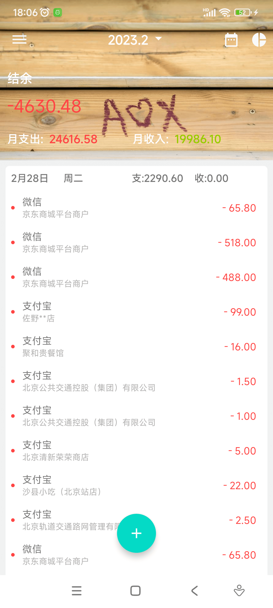
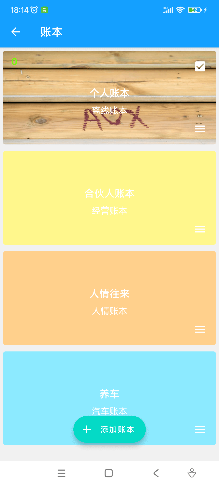
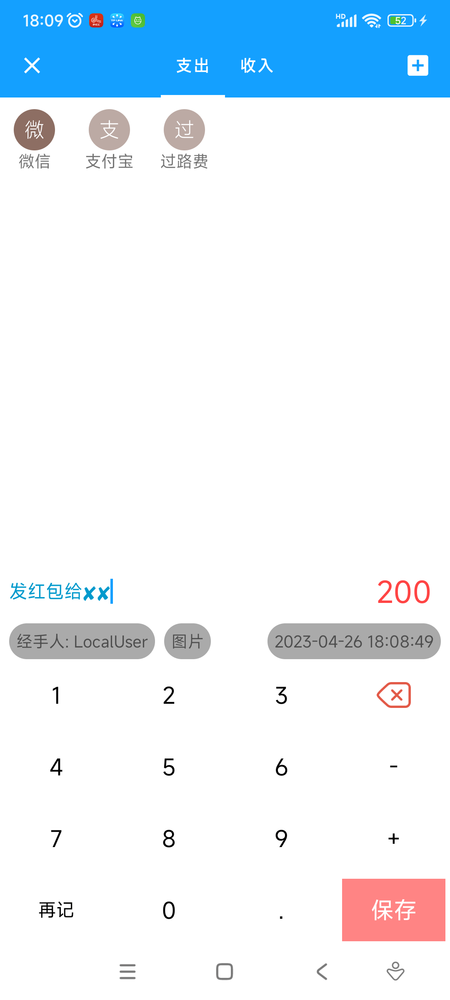
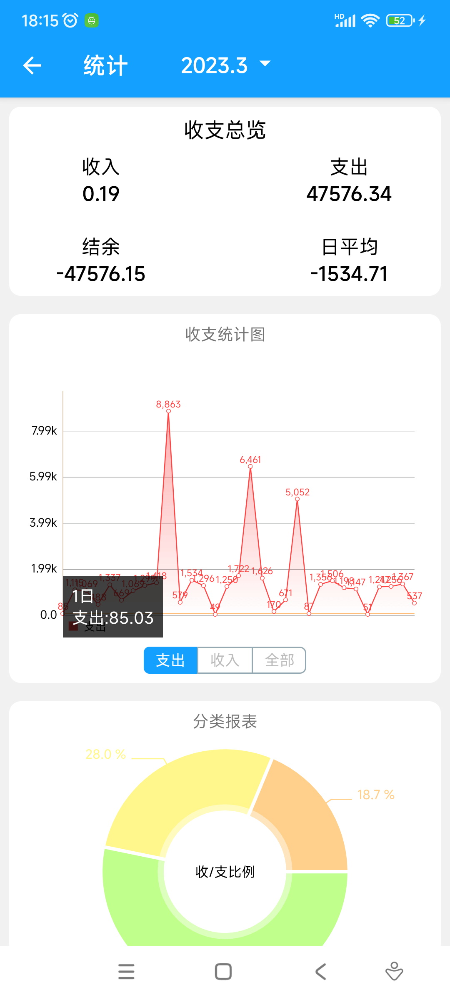
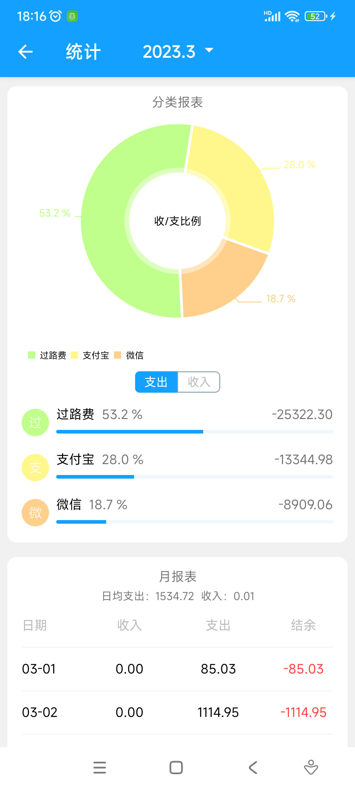
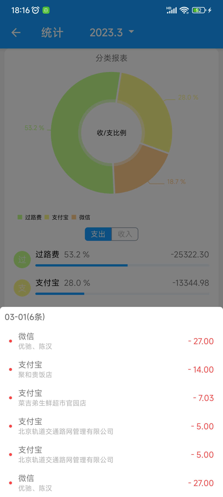
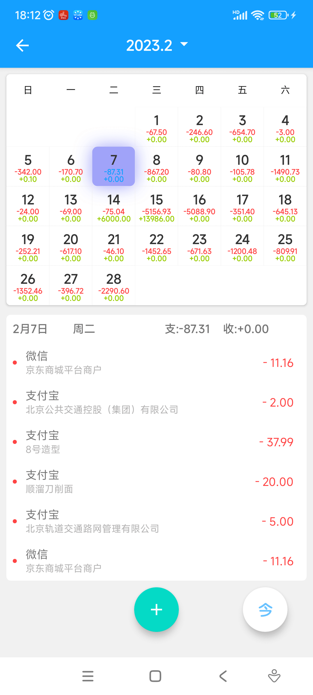
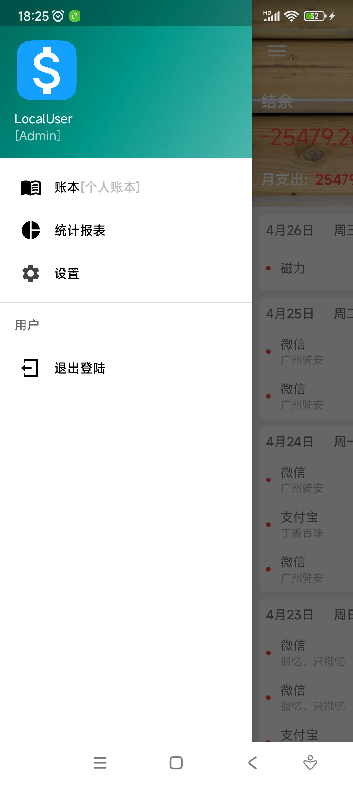
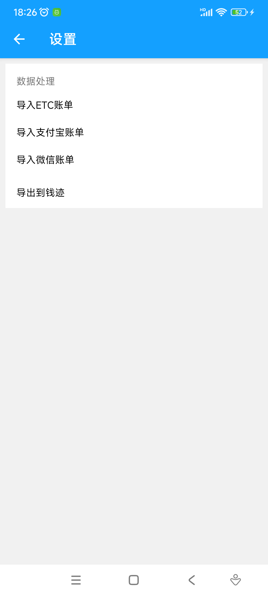

# 合記（Heji）

[](./LICENSE)


合記是一个面向多人协作场景的 Android 记账应用，支持多人共同维护账本、账单导入导出、多维统计分析，以及本地优先的数据同步体验。

本项目是一个**个人练手 / 学习项目**，重点聚焦 Android 客户端能力、离线优先的数据模型，以及多人协作记账场景的同步设计。它更适合希望了解 **Android 记账应用实现方式、多人协作权限设计、本地优先同步方案** 的开发者或学习者。UI 和产品体验参考了**钱迹**的一些优秀思路，但**本项目并非钱迹官方项目，也与其没有隶属关系**。感谢原产品与开发者带来的启发。

## 核心特性

- **多人协作记账**：支持创建账本、口令分享、成员协作记账，并基于创建人与成员区分权限。
- **本地优先同步**：所有数据先写入本地数据库，再通过 HTTP 与服务端同步，并用 MQTT 做变更通知。
- **导入与导出**：支持从支付宝、微信、ETC、Excel、CSV、钱迹导入账单，并导出为 Excel、CSV、钱迹格式。
- **多维统计分析**：提供支出占比、收支结构、趋势图、报表、总览等统计能力。
- **票据与查重**：账单支持票据图片、备注等信息，并可通过时间、金额、票据 MD5 做重复检测。

## 功能概览

| 模块 | 能力 |
| --- | --- |
| 账本 | 创建账本、口令分享、成员协作、账本分类 |
| 权限 | 仅创建者可删除账本；多人协作下仅可修改/删除自己创建的账单 |
| 账单 | 收入 / 支出、金额、时间、票据图片、备注、经手人、类别 |
| 导入 | 支付宝、微信、ETC、Excel、CSV、钱迹 |
| 导出 | Excel、CSV、钱迹 |
| 统计 | 人员支出占比、类别走势、收支结构、月/年报表、总览 |

## 界面预览

> 账本封面拍摄于 2018 年和田玉泉湖公园的木阶梯，后续计划支持账本封面自定义。

<table>
  <tr>
    <td></td>
    <td></td>
    <td></td>
  </tr>
  <tr>
    <td></td>
    <td></td>
    <td></td>
  </tr>
  <tr>
    <td></td>
    <td></td>
    <td></td>
  </tr>
</table>

## 架构与同步

当前仓库以 **Android 客户端工程**为主，整体采用单 Activity、多 Fragment 的应用结构。核心数据存储在本地 Room 数据库中，围绕“先本地、后同步”的原则组织数据流：

- **本地优先**：所有 CRUD 先落本地，再异步同步到服务端。
- **HTTP 负责上行**：客户端通过 HTTP REST API 上传新增、修改、删除。
- **MQTT 负责通知**：服务端通过 MQTT 向其他客户端广播数据变更通知。
- **增量拉取兜底**：在离线、断连或推送丢失场景下，客户端通过增量拉取保证最终一致性。

当前仓库**未包含完整服务端工程**。如果你想体验多人同步相关能力，需要自行提供与 [`docs/sync-v2.md`](./docs/sync-v2.md) 约定兼容的服务端接口和 MQTT 环境；如果只想阅读客户端实现、界面与本地数据流，可以先完成本地构建。

## 本地构建运行

### 环境要求

- Android Studio（推荐使用较新的稳定版）
- JDK 17
- Android SDK 36
- Gradle 9.3.1（仓库已自带 Wrapper）
- Android 7.0+ 设备或模拟器（`minSdk = 24`）

### 必要配置

项目在 Gradle 配置阶段会读取本地签名和服务端地址配置，因此在本地运行前需要补齐以下属性。即使是本地 Debug 构建，也需要提供签名字段，因为当前构建脚本对 Debug / Release 使用了统一签名配置。

`local.properties`：

```properties
KEYSTORE_PATH=...
KEYSTORE_PASSWORD=...
KEY_ALIAS=...
KEY_PASSWORD=...
```

`gradle.properties`：

```properties
LOCALHOST=http://...
HJSERVER=https://...
```

### 快速开始

1. 克隆仓库并使用 Android Studio 打开项目根目录。
2. 按上面的示例补齐 `local.properties` 与 `gradle.properties`。
3. 如果你需要验证同步流程，请将 `LOCALHOST` 指向可用的服务端地址，并准备兼容的 MQTT 环境。
4. 如果你暂时没有服务端环境，仍然可以完成项目构建、阅读客户端实现，并调试不依赖远端同步的本地界面与数据流。
5. 使用 Android Studio 直接运行，或执行下面的 Gradle 命令构建 Debug APK。

### 构建 Debug APK

```bash
./gradlew --no-daemon :app:assembleDebug
```

### 运行单元测试

```bash
./gradlew --no-daemon testDebugUnitTest
```

## 技术栈

- **语言与平台**：Kotlin、Java、AndroidX
- **架构与导航**：Single-Activity、多 Fragment、Navigation
- **本地存储**：Room、MMKV
- **依赖注入**：Koin
- **网络通信**：Retrofit、OkHttp、MQTT
- **异步与后台任务**：WorkManager
- **图表与界面能力**：MPAndroidChart、XPopup、Glide、CalendarView

## 致谢

- 感谢 **钱迹** 在记账产品体验上的优秀设计与启发。
- 合記以学习和实践为主要目的，用于探索多人记账、同步模型和 Android 客户端工程化能力。

## License

本项目基于 [Apache License 2.0](./LICENSE) 开源。
