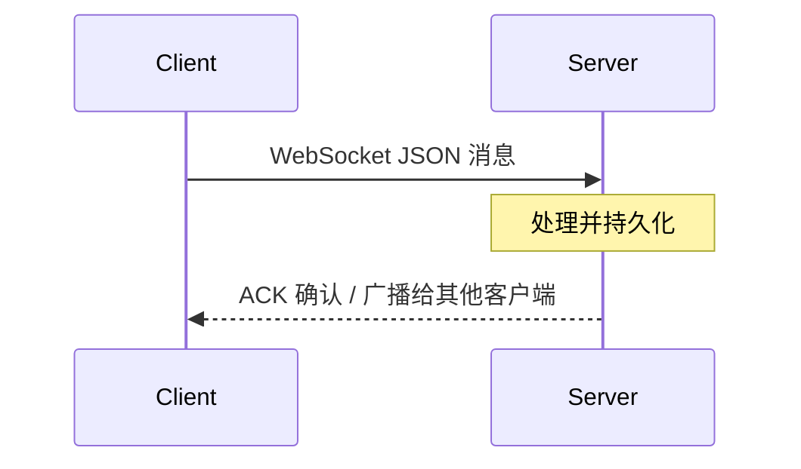
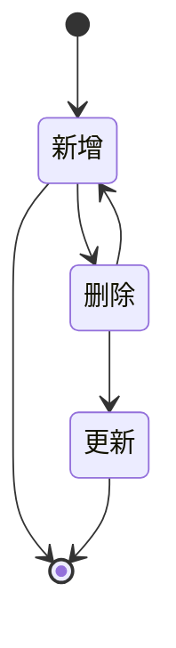

# 客户端与服务端的数据同步

## 本地优先

本地 Token 存在的情况下，在无网络下可以创建账本、账单，待连接网络后与服务器同步。

## ID 生成

客户端使用 [Xid](https://github.com/0xShamil/java-xid) (`com.github.0xshamil:java-xid:1.0.0`) 生成全局唯一 ID，替代原有的 MongoDB ObjectId。  
Xid 基于时间戳 + 随机值 + 自增计数器，生成 20 字符的 base32 编码字符串，天然有序且无需中心化协调。

## 消息协议

同步消息使用 **JSON** 格式（替代原有的 Protobuf），结构如下：

```json
{
  "id": "bt0j9l2s5bo37fcla7q0",
  "type": "ADD_BILL",
  "sender_id": "user_xid",
  "content": "{...实体JSON...}",
  "receiver_ids": ["user1", "user2"]
}
```

### 消息类型

| 类型 | 说明 |
|------|------|
| `ADD_BILL` / `ADD_BILL_ACK` | 新增账单 |
| `DELETE_BILL` / `DELETE_BILL_ACK` | 删除账单 |
| `UPDATE_BILL` / `UPDATE_BILL_ACK` | 更新账单 |
| `ADD_BOOK` / `ADD_BOOK_ACK` | 新增账本 |
| `DELETE_BOOK` / `DELETE_BOOK_ACK` | 删除账本 |
| `UPDATE_BOOK` / `UPDATE_BOOK_ACK` | 更新账本 |

## 同步架构

同步主要针对账本和账单，采用 WebSocket 实时通道：

1. 客户端使用 Xid 保证数据唯一性
2. 客户端数据变更后通过 `SyncTrigger` 观察本地数据库变化并触发同步
3. 数据流：View → DB → Sync（仅与本地数据库交互）
4. 服务端接收消息后广播给同账本下的其他用户

### 客户端组件

| 组件 | 职责 |
|------|------|
| `WebSocketClient` | WebSocket 连接管理，发送/接收 JSON 消息 |
| `SyncReceiver` | 接收消息并分发给对应的 Handler |
| `SyncTrigger` | 观察本地数据库变化，触发向服务端同步 |
| `SyncMessage` | JSON 消息数据类 |
| `IMessageHandler` | 消息处理器接口（BillHandler、BookHandler） |

### 服务端（heji-server）

后端使用 Go + Ent ORM + MQTT 架构，通过 `SyncService` 处理消息的发布和订阅。




