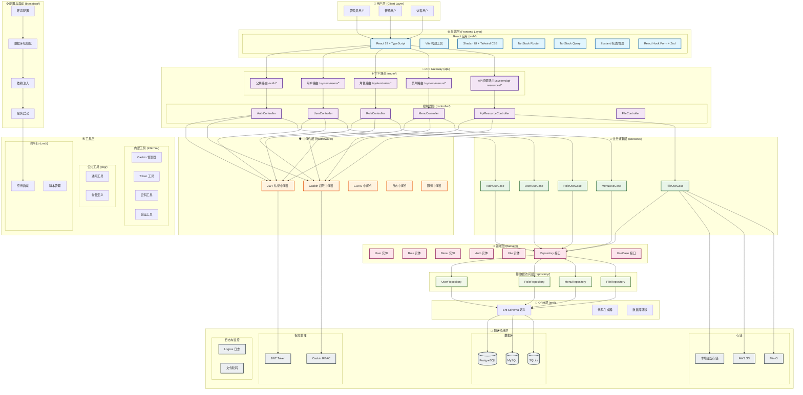
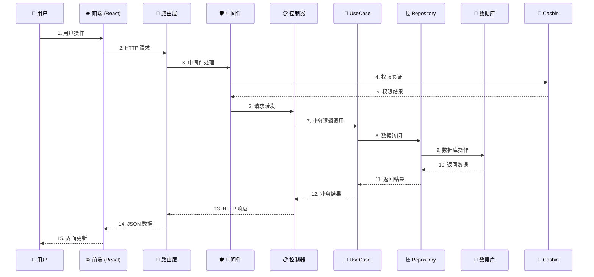
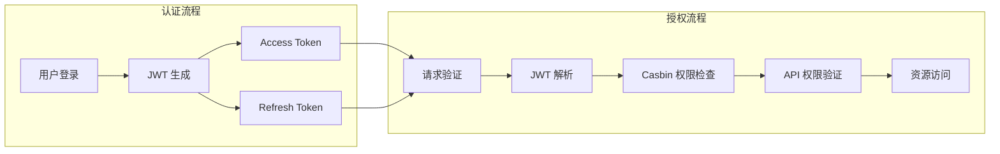
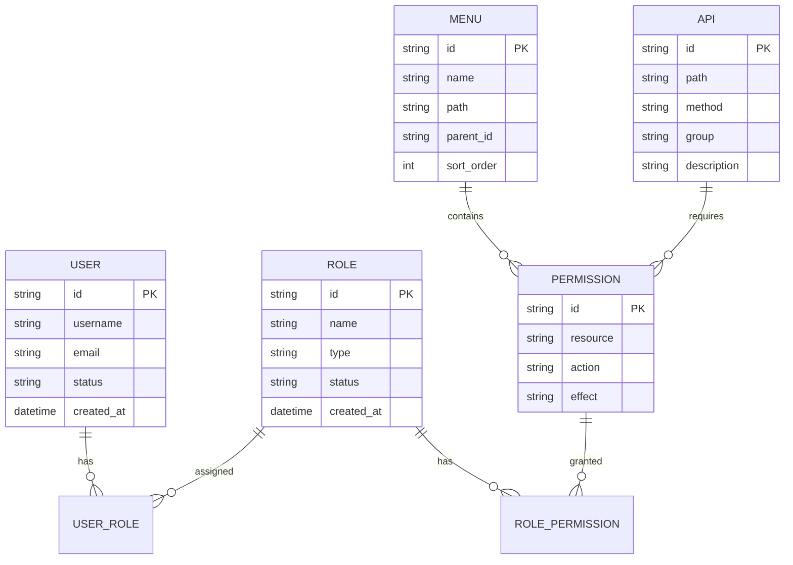
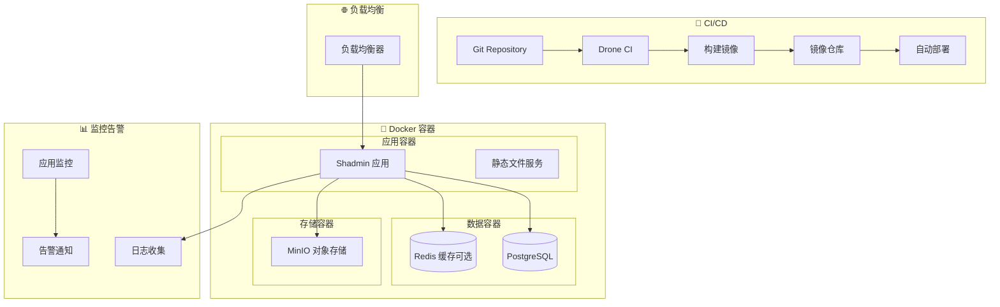

# Shadmin 项目架构图

## 🏗️ 系统总体架构

## 🔄 数据流向图

## 🎯 核心功能架构

### 🔐 认证授权架构

### 📊 RBAC 权限模型

## 🚀 部署架构

## 📝 技术栈总览

### 后端技术栈
- **🔧 核心框架**: Go 1.24 + Gin
- **🗄️ 数据库**: Ent ORM (PostgreSQL/MySQL/SQLite)
- **🔐 权限**: Casbin RBAC + JWT
- **📁 存储**: 本地/S3/MinIO
- **📖 文档**: Swagger/OpenAPI
- **📊 日志**: Logrus

### 前端技术栈
- **⚛️ 核心框架**: React 19 + TypeScript
- **🎨 UI 框架**: Shadcn UI + Tailwind CSS
- **🔧 构建工具**: Vite
- **🌐 路由**: TanStack Router
- **📊 状态管理**: Zustand
- **🔄 数据获取**: TanStack Query
- **📋 表单**: React Hook Form + Zod

## 🔍 项目特点

1. **🏗️ 清洁架构**: 严格的分层设计，依赖倒置原则
2. **🔐 安全优先**: JWT + RBAC 双重安全保障
3. **📱 现代技术栈**: 使用最新的 React 19 和 Go 1.24
4. **🚀 高性能**: Ent ORM + Gin 框架组合
5. **🔧 可扩展**: 支持多数据库、多存储后端
6. **📊 可观测**: 完整的日志和监控支持
7. **🐳 容器化**: Docker 多阶段构建，支持容器化部署

---
**生成时间**: 2025-09-14
**版本**: v1.0
**维护者**: Shadmin Team